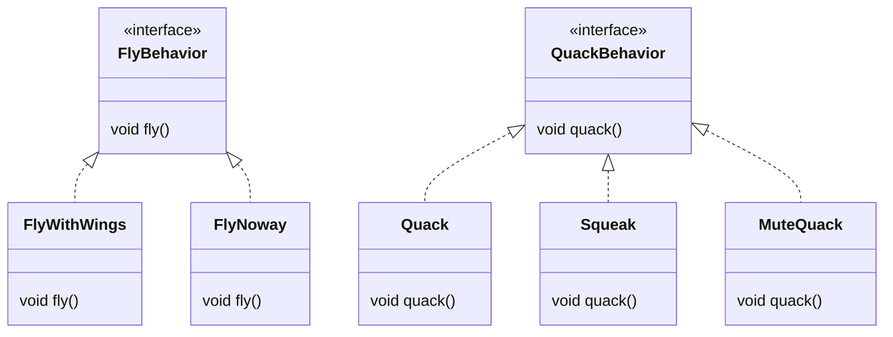
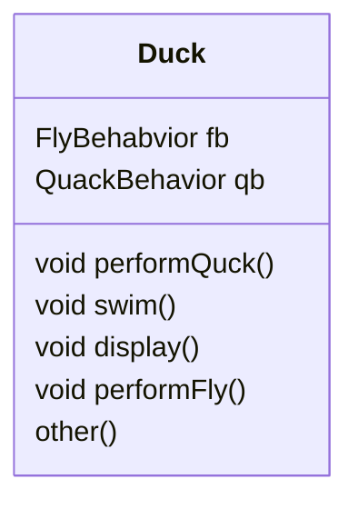
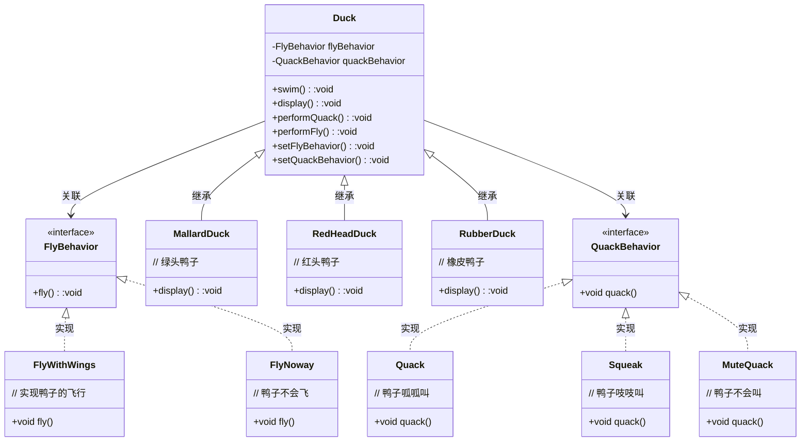
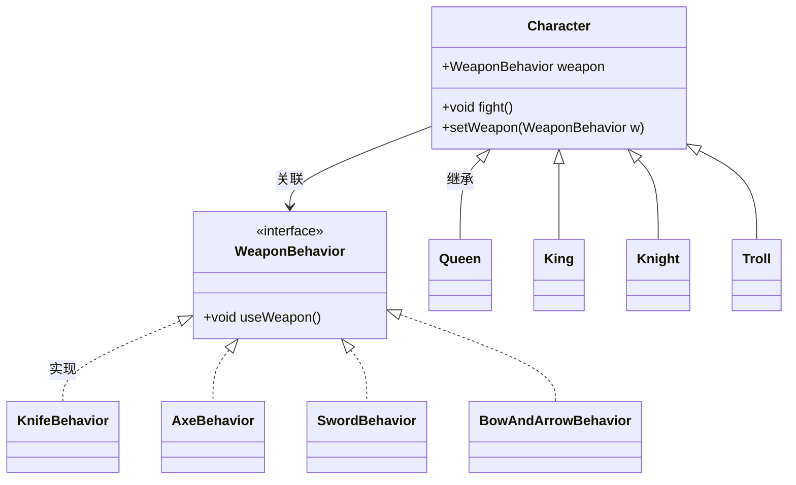

> 把模式装进脑子里，然后在你的设计和已有的应用中，寻找何处可以使用他们。

# 1 设计模式入门

> 设计原则：找出应用中可能需要变化之处，将他们独立出来，不要和那些不需要变化的代码换在一起。

将会变化的部分抽取并进行封装，以便以后可以轻易改动或者扩充此部分，而不影响不需要变动的其他部分。

为了易于维护和扩展，我们将鸭子的`fly()`和`quack()`两个行为抽离出来，建立一组新类来代表每一个行为。

## 设计鸭子的行为

> 设计原则：针对接口编程，而不是针对实现编程。

不管是继承抽象类或者是实现某一个接口，这两种做法都是依赖于实现，我们被实现绑死了。使用一组其他类专门实现`FlyBehavior`和`QuackBehavior`，这就称为**行为类**。



这样设计，可以让飞行和叫的动作被其他对象复用，因为这些已经和鸭子类无关了。

## 整合鸭子的行为

鸭子现在将**飞行**和**呱呱叫**的两个行为==委托==给其他的类处理，而不是使用定义在`Duck`类中的呱呱叫和飞行的方法。

具体的整合方案为：

* 在`Duck`中引入两个关联动作的实例变量；
* 实现相关的动作



```java
public class Duck {
    
	QuackBehavior quackBehavior;
    
    public void performQuack() {
        quackBehavior.quack();
    }
}
```


## 动态设定鸭子的行为

在鸭子子类中通过**设定方法(setter method)**来设定鸭子的行为，而不是在鸭子的构造器内部实例化，这样在运行的时候，想要改变鸭子的行为，只需要调用鸭子的`setter`方法即可。


## 封装行为的大局观



## ==有一个==可能比==是一个==更好

> 设计原则：多用组合，少用继承。

使用组合建立系统具有很大的弹性，不仅可以将算法族封装成类，更可以“在运行时动态改变行为”，只要组合的行为对象复合正确的接口标准即可。


## 策略模式

> **策略模式**定义了算法族，分别封装起来，让他们之间可以相互替换，此模式让算法的变化独立于使用算法的客户。


## 设计谜题



## 如何使用设计模式？

当我们装入了许多关于设计模式的知识，就可以开始在新设计中采用他们，并当我们的旧代码成为“屎山”的时候，可以用他们重做旧代码。
