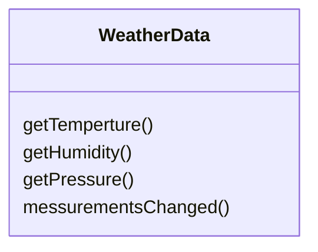
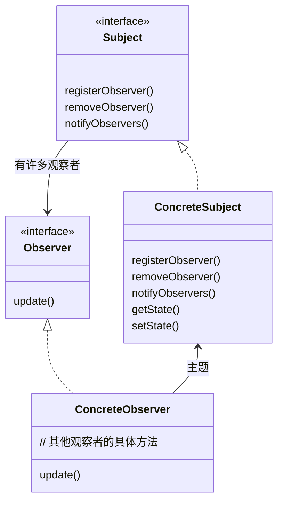
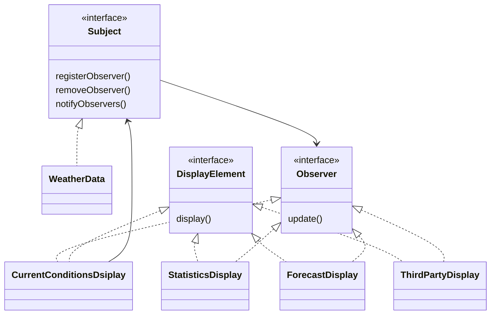

# 观察者（Observer）模式

## 气象监测应用的概况

`WeatherData`对象向物理气象站取得数据之后，会通过我们实现的方法更新三个布告板的显示。

## WeatherData类

## 先决条件

* 通过`WeatherData`对象可以获取三个测量值
* 当新数据更新时候，`messurementChanged()`方法就会被调用
* 需要通过`WeatherData`类更新三个布告板
* 系统必须可以扩展，让其他开发人员建立定制的布告板

## 出版者＋订阅者=观察者模式

出版者称为**主题(Subject)**，订阅者称为**观察者(Observer)**。

> **观察者模式**定义了对象之间一对多依赖，这样一来，当一个对象改变的时候，他的所有依赖者都会收到通知并且自动更新。

## 类图

*  每一个主题可以有多个观察者
* 具体的观察者必须注册具体主题，以便接收更新
* 具体的主题有获取和设置状态的方法

## 松耦合的威力

两个对象之间松耦合，他们之间依旧可以交互，但是不太清除彼此的细节。观察者模式提供了一种对象设计，让主题和观察者之间松耦合。

* 主题只是知道观察者实现了某一个接口，但是不知道观察者的具体类的实现细节
* 任何时候我们都可以新增或者删除观察者
* 当有新类型的观察者出现时候，主题代码不需要修改
* 改变主题或者观察者其中一方，并不会影响另一方，因为二者是松耦合的

> 设计原则：为了交互对象之间的松耦合设计而努力。

## 气象站类图

## 实现气象站

见`src`

## Java内置观察者模式

* 将对象变为一个观察者：实现观察者接口`java.util.Observer`
* 观察者送出通知
  * 调用`setChanged()`方法，标记状态改变的事实
  * 调用两个`notigfyObservers()`方法中的一个
* 观察者接收通知：`update(Observerable o, Object arg)`

**缺点？**

* `Observable`是一个类，而非接口，限制了他的使用和复用
* `setChanged()`方法被保护起来，无法创建`Observable`实例并组合到自己的对象中来，违反了“多用组合，少用继承”的设计原则

## 挑战设计原则

* 在观察者模式中，会变的是主题的状态，以及观察者的数目和类型，将变化的部分进行分离，改变依赖主题的对象时候，不必改变主题
* 主题与观察者都使用接口，观察者利用主题的接口向主题注册，而主题利用观察者接口通知观察者
* 观察者模式利用“组合”将许多观察者组合进主题中。对象之间的关系不是通过继承产生的，而是在运行时利用组合的方式产生的