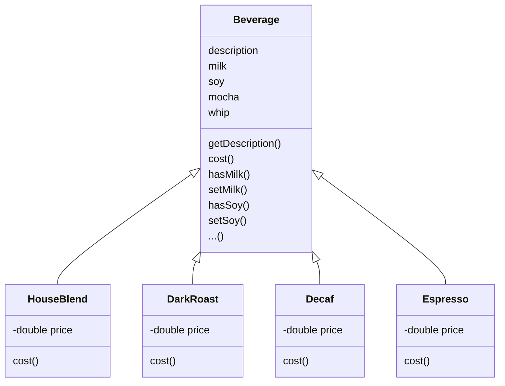
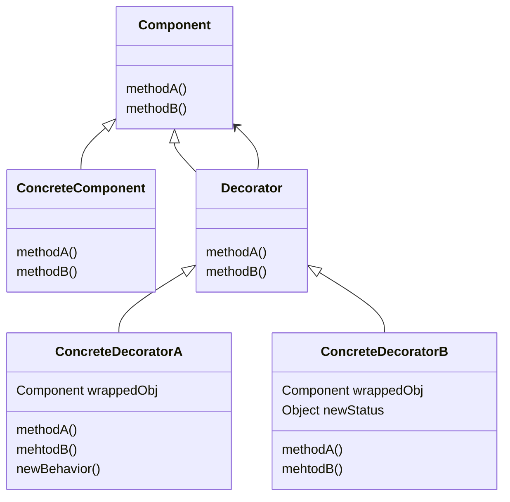

# 3 装饰者模式

## 星巴克咖啡

实现订单系统，计算出每一杯饮料的价格。



* `cost()`方法并非抽象方法，而是实现的，计算出调料价钱，子类重写方法，计算出调料加饮料的钱

```java
public class Beverage {
    ...
    public double cost() {
        double condimentPrice = 0.0;
        if (hasMilk()) { condimentPrice += milkPrice; }
        if (hasSoy()) { condimentPrice += soyPrice; }
        return condimentPrice;
    }
}

public class DarkRoast extends Beverage {
    public DarkRoast() {
        description = "Most Excellent Dark Roast!";
    }
    
    @Override
    public double cost() {
        return super.cost() + price;
    }
}
```

**存在的问题**

* 新的调料出现，我们就会修改抽象类`Beverage`
* 对于许多饮料来说，某些调料并不适合继承


## 开放关闭原则

> **设计原则**：类应当对扩展开放，对修改关闭。

我们的目标是允许类容易扩展，在不修改现有代码的情况下，就可以搭配新的行为。这样的设计具有弹性，可以应对改变，可以接受新的功能来应对改变的需求。

**TIPS**

* 遵循开闭原则，通常会引入新的抽象层次，增加代码的复杂度。只需要关注那些最有可能改变的地方，应用开闭原则


## 装饰者构造饮料订单

* 以`DarkRoast`对象开始
* 如果想要摩卡，建立一个`Mocha`对象，将`DarkRoast`对象包起来
* 如果想要奶泡，建立一个`Whip`装饰者，将`Mocha`对象包起来
* 通过最外层的装饰者`cost()`方法就可以计算出价钱

> 关于装饰者
>
> * 装饰者和被装饰者有相同的超类
> * 可以使用一个或者多个装饰者包装一个对象
> * 既然装饰者和被装饰者具有相同的超类型，可以在任何需要原始对象的场合，可以用装饰过的对象代替它（李氏替换原则）
> * <u>装饰者可以在所委托被装饰者行为之前与/或之后，加上自己的行为，可以达到特定的目的</u>
> * 对象可以在任何时候被装饰，可以在运行时动态的，不限量地使用你最喜欢的装饰者来装饰对象


## 定义装饰者模式

> **装饰者模式**动态地将责任附加到对象上。若要扩展功能，装饰者提供了比继承更有弹性的替代方案。




* `ConcreteComponent`是被装饰的的原始对象
* 装饰者有一个实例变量保存某个`Component`的引用
* 装饰者可以添加新的方法，也可以扩展新的状态


## 星巴克订单代码

见`src`