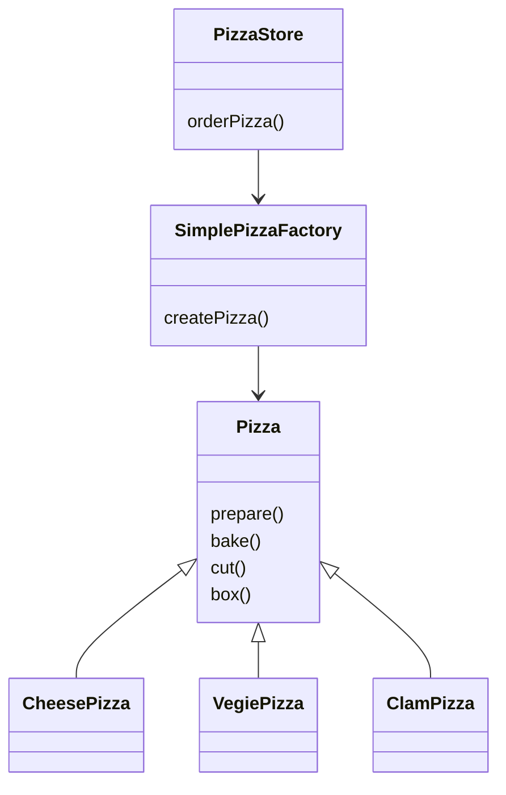
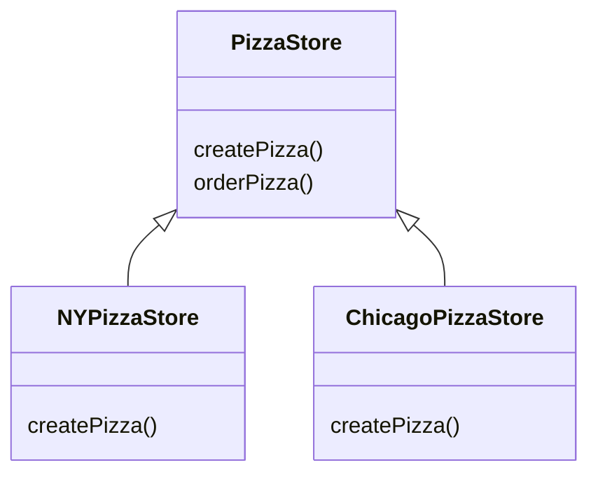
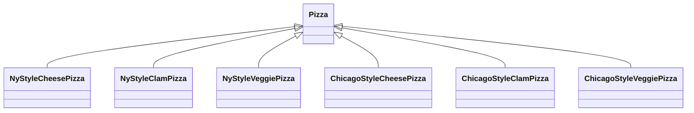
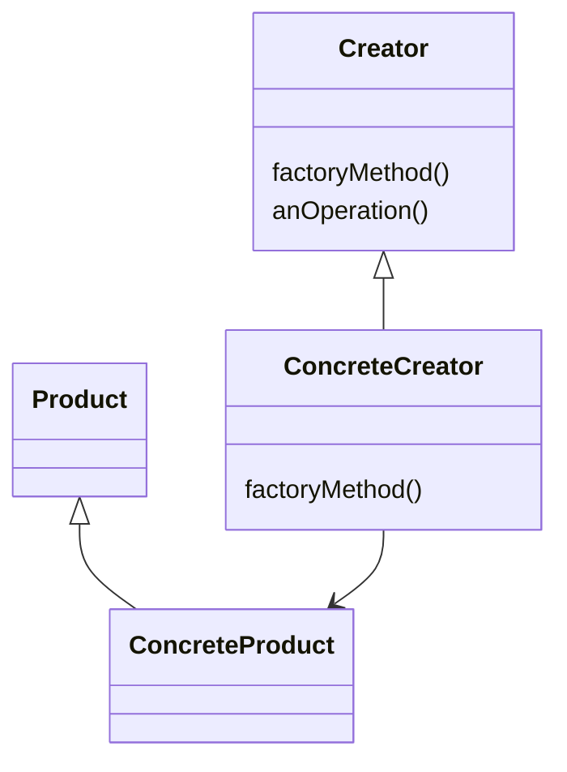

# 工厂模式

## “new”有什么不对劲？

有违**对扩展开放，对修改关闭**的设计原则。

## 封装创建对象的代码

将创建对象移动到`orderPizza()`之外的一个新对象中去，由这个新对象专职创建披萨。我们这个新对象为**工厂**，工厂负责创建对象的细节。

## 简单的披萨工厂

```java
public class SimplePizzaFactory {
    public Pizza createPizza(String type) {
        Pizza pizza = null;
        if ("cheese".equals(type)) {
            pizza = new CheesePizza();
        } else if ("clam".equals(type)) {
            pizza = new ClamPizza();
        } else {
            // ...
        }
        return pizza;
    }
}
```

* 这样将代码搬离出来就是为了解耦合，同时为了复用工厂
* 静态工厂方法的缺点就是不能通过继承来改变创建方法的行为

## 定义简单工厂

简单工厂并不是一个设计模式，并非是**工厂模式**。



> 在设计模式中，所谓的实现一个接口，并不一定是一个实现类使用`implement`关键字实现某个Java接口，而是泛指实现某一个超类型，可以是类或者接口的某个方法。

## 声明一个工厂方法

原本是由一个对象负责所有具体类的实例化，现在变为一群子类负责实例化。

```java
protected abstract Pizza createPizza(String type);
```

* 实例化对象的责任被移动到一个方法中，这个方法如同为一个工厂。工厂方法用来处理对象的创建，并将这样的行为封装在子类中

## 工厂方法模式

所有的工厂模式都是用来封装对象的创建。工厂方法模式(Factory Method Pattern)通过让子类决定该创建的对象是什么，来达到将对象创建的过程封装的目的。

### 创建者类



* 抽象创建者定义了一个抽象工厂方法`createPizza()`
* 子类实现`createPizza`创建自己风味的披萨

### 产品类



* 创建者类和产品类是平行的，他们都有抽象类，每个抽象类都有许多具体的子类，每个子类有自己特定的实现

## 定义工厂方法模式

> **工厂方法模式**定义了一个创建对象的接口，但是子类决定要实例化的类是哪一个，工厂方法让类将实例化推迟到子类。



* 工厂方法模式帮助我们将产品的实现从使用中解耦出来，如果增加产品或者改变产品，创建者并不会受到影响
* 工厂方法和创建者并不一定都是抽象的

**简单工厂和工厂方法的区别**

* 简单工厂将全部的事情在一个地方都处理完毕了
* 工厂方法只是创建一个框架，让其子类决定如何具体实现
* 简单工厂可以将对象的创建封装起来，但是不具备工厂方法的弹性，因为简单工厂不能变更正在创建的产品

## 依赖倒置原则

> 设计原则：要依赖抽象，不要依赖具体类

不要让高层组件依赖底层组件，而且不管高层或者低层组件，两者都应当依赖于抽象。

## 什么是倒置？

倒置指的是和一般的OO设计的思考方式完全相反，低层组件依赖高层组件的抽象，高层组件也依赖相同的抽象。

## 几个指导方针

* 变量不可以持有具体类的引用

  如果使用`new`，就会持有具体类的引用，可以使用工厂来避开这样的做法

* 不要让类派生自具体类

  如果派生自具体类，就会依赖于具体类

* 不要覆盖基类已经实现的方法

  基类中已经实现的方法，应当由所有的子类共享

## 重构披萨店

见`src`

## 我们做了什么？

引入新类型的工厂，也就是所谓的**抽象工厂**，来创建披萨原料家族。

通过抽象接口工厂所提供的的接口，可以创建产品的家族，利用这个接口书写代码，我们的代码就将从实际工厂中解耦，以便在不同的上下文中实现不同的工厂，制造出不同的产品。

## 定义抽象工厂模式

> **抽象工厂模式**提供了一个接口，用于创建相关或依赖对象的家族，而不需要明确指定其具体类。


抽象工厂中的方法经常以工厂方法的方式实现。抽象工厂的任务就是定义一个负责创建一组产品的接口。这个接口内的每个方法都负责创建一个具体的产品，同时我们利用实现抽象工厂的子类来提供这些具体的做法。

## 总结

* 所有的工厂都是用来封装对象的创建
* 简单工厂，虽然不是真正的设计模式，但是仍不失为一个简单的方法
* 工厂方法使用继承，将对象的创建委托给子类，子类实现工厂方法来创建对象
* 抽象工厂使用对象的组合：对象的创建被实现在工厂接口所暴露的方法中
* 工厂方法允许将实例化延迟到子类中
* 抽象工厂创建相关的对象家族，而不需要依赖他们的具体类