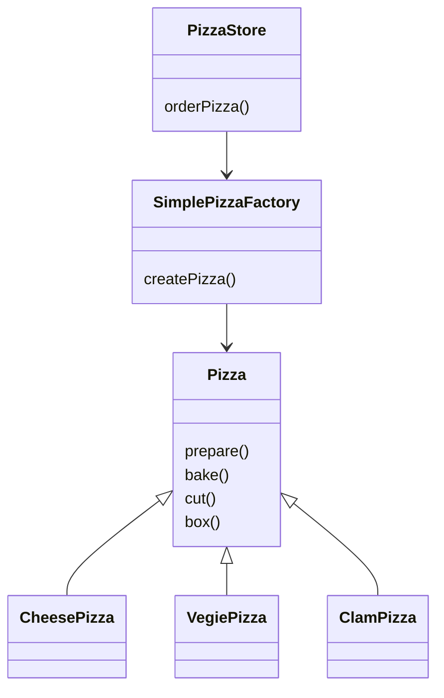

# 工厂模式

## “new”有什么不对劲？

有违**对扩展开放，对修改关闭**的设计原则。

## 封装创建对象的代码

将创建对象移动到`orderPizza()`之外的一个新对象中去，由这个新对象专职创建披萨。我们这个新对象为**工厂**，工厂负责创建对象的细节。

## 简单的披萨工厂

```java
public class SimplePizzaFactory {
    public Pizza createPizza(String type) {
        Pizza pizza = null;
        if ("cheese".equals(type)) {
            pizza = new CheesePizza();
        } else if ("clam".equals(type)) {
            pizza = new ClamPizza();
        } else {
            // ...
        }
        return pizza;
    }
}
```

* 这样将代码搬离出来就是为了解耦合，同时为了复用工厂
* 静态工厂方法的缺点就是不能通过继承来改变创建方法的行为

## 定义简单工厂

简单工厂并不是一个设计模式，并非是**工厂模式**。



> 在设计模式中，所谓的实现一个接口，并不一定是一个实现类使用`implement`关键字实现某个Java接口，而是泛指实现某一个超类型，可以是类或者接口的某个方法。

## 声明一个工厂方法

原本是由一个对象负责所有具体类的实例化，现在变为一群子类负责实例化。

```java
protected abstract Pizza createPizza(String type);
```

* 实例化对象的责任被移动到一个方法中，这个方法如同为一个工厂。工厂方法用来处理对象的创建，并将这样的行为封装在子类中