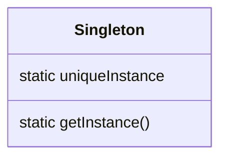

# 单例模式

> [查看源码](https://github.com/shepi-666/design-patterns)

## 剖析经典单例模式实现

```java
public class Singleton {
    private static Singleton uniqueInstance;
    
    // 私有构造器
    private Singleton() { }
    
    // 获取单例的方法
    public static Singleton getInstance() {
        // 如果之前没有创建过实例
        if (uniqueInstance == null) {
            uniqueInstance = new Singleton();
        }
        return uniqueInstance;
    }
}
```

## 模式独白

* 单例模式使得一个类在任何时候都只产生一个对象
* 单例模式主要用来管理共享的资源，例如数据库连接池或者线程池等
* 单例模式的构造器都是私有的

##  定义单例模式

> **单例模式** 确保类只有一个实例，并提供一个全局访问点。



## 处理多线程

```java
public class Singleton {
    
   	private static Singleton uniqueInstance;
    
    /**
    * 迫使每个线程在进入方法之前，先等候别的线程离开此方法
    */
   	public static synchronized Singleton getInstance() {
        if (uniqueInstance == null) {
            uniqueInstance = new Singleton();
        }
        return uniqueInstance;
    }
}
```

> 只有第一次执行此方法才需要同步，否则就不需要进行同步。

## 改进方式

### 饿汉模式

如果程序总是创建并使用单例模式，或者在创建和运行的时候负担不是很繁重，就可以使用饿汉模式创建单例。

```java
public class Singleton {
    
    /**
    * 饿汉模式创建实例,保证任何线程访问uniqueInstance静态变量之前都一定先创建此实例
    */
   	private static Sigleton uniqueInstance = new Singleton();

    private Singleton();
    
    
   	public static Singleton getInstance() {
        return uniqueInstance;
    }
}
```

### 双重检查锁

```java
/**
 * @author DongShaowei
 * @description 双重检查锁实现单例模式
 * @date 2022/8/30 10:51
 */
public class Singleton4 {

    private volatile static Singleton4 uniqueInstance;

    private Singleton4() { };


    public static Singleton4 getInstance() {
        if (uniqueInstance == null) {
            synchronized (Singleton4.class) {
                if (uniqueInstance == null) {
                    uniqueInstance = new Singleton4();
                }
            }
        }
        return uniqueInstance;
    }
}
```

## 总结

* 单例模式确保程序中一个类最多只有一个实例
* Java中实现单例模式需要私有构造器、一个静态方法和一个静态变量
* 确定在性能和资源的限制，然后选择合适的方案实现单例
* 如果使用多个类加载器，可能导致单例模式失效而产生多个实例