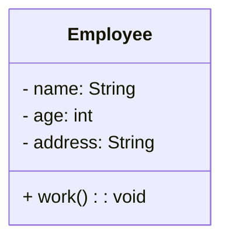
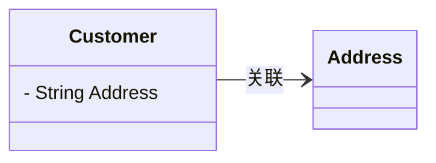
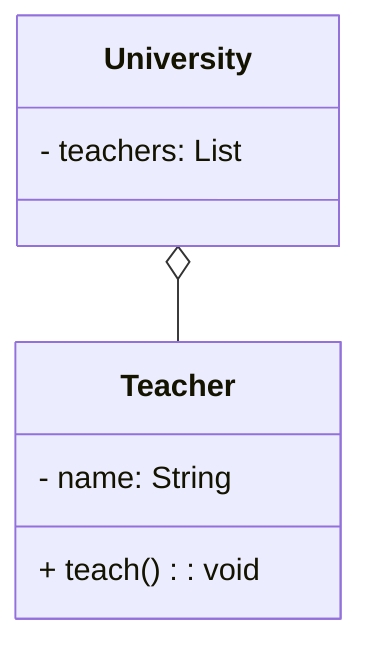
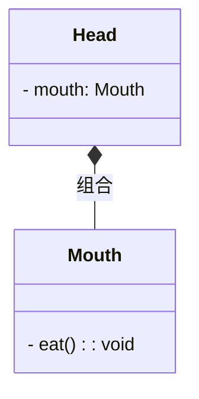
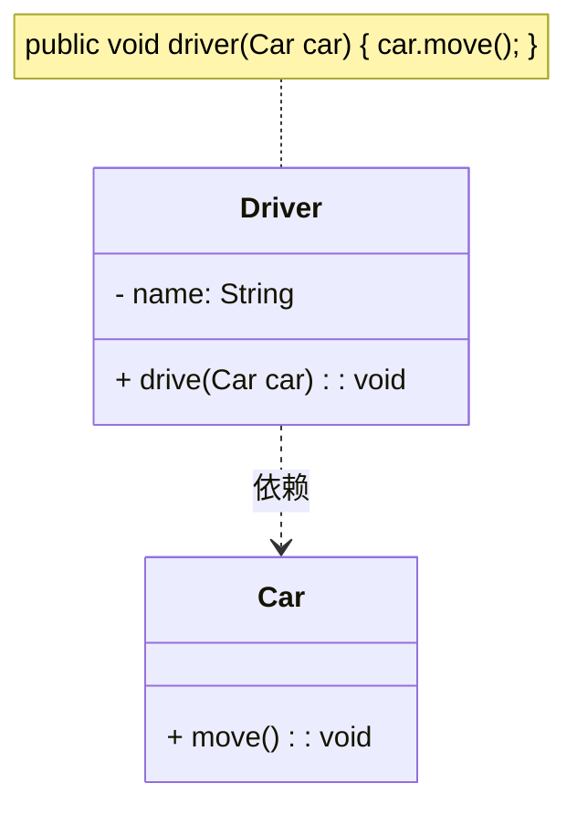
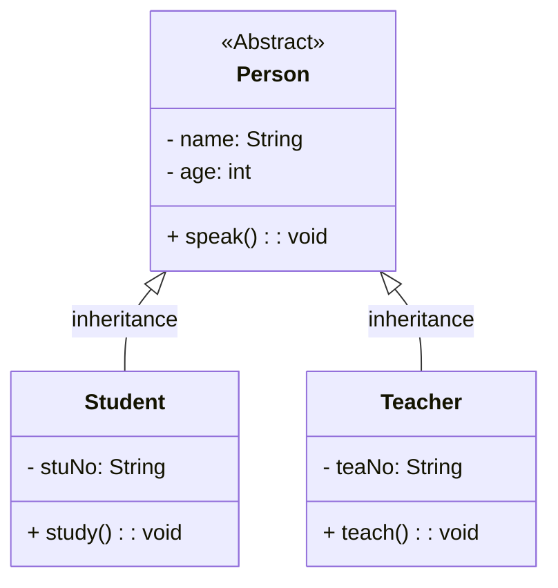
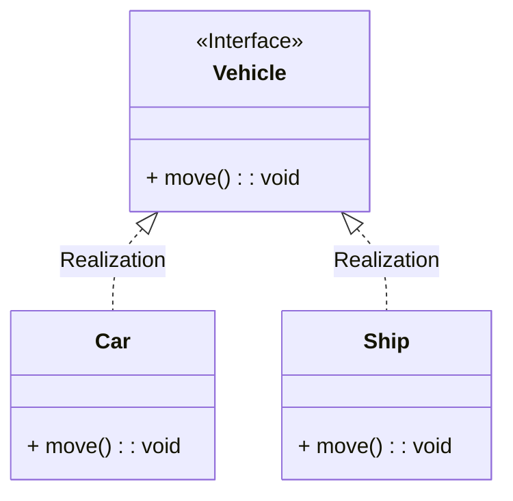

# UML类图

统一建模语言(Unified Modeling Language, UML)用来设计软件的可视化建模语言。特点是简单、统一、图形化，能表达软件设计中的动态与静态信息。

## 1 类图概述

类图（Class Diagram）显示了模型的静态结构，特别是模型中存在的类、类的内部结构以及他们与其他类的关系等。类图不显示暂时性的信息，类图是面向对象加墨的主要组成部分。

## 2 类图的表示方法

在UML类图中，类使用属性(field)和方法(method)且带有分割线的矩形来表示。

属性|方法名称前面的加号+和减号-表示属性的可见性，UML类图中表示可见性的符号有三种：

* `+`：表示`public`
* `-`：表示`private`
* `#`：表示`protected`

属性的完整表示方法是：**可见性 名称 : 类型**

方法的完整表示格式是：**可见性 名称(参数列表) : 返回值**

## 3 类与类之间的表示方式

### 3.1 关联关系

关联关系式是对象之间的一种引用，表示**一类对象和另一类对象之间的联系**，例如老师和学生、丈夫和妻子等等。关联关系可细分为**一般关联关系**、**聚合关系**以及**组合关系**。

**1）一般关联**

* **表示方法**：带箭头的实线
* **语法**：`-->`

### 3.2 聚合关系

聚合关系式关联关系的一种，**是弱关联关系，部分可以脱离整体而存在**，例如大学和老师之间的关系。

* **表示方法**：菱形实线
* **语法**：`o--`

### 3.3 组合关系

整体与部分之间的关系，但是一种更强烈的聚合关系，部分对象不能够脱离整体而存在。例如头和嘴之间的关系。

* **表示方法**：实心菱形的实线
* **语法**：`*--`

### 3.4 依赖关系

依赖关系是一种使用关系，是对象之间耦合性最弱的关联关系，是临时性的关联。比如某个类通过局部变量、方法的参数或者对静态方法的调用类访问另一个类中的某些方法完成一些职责。例如司机使用汽车完成拉客的活动。

* **表示方法**：虚线箭头
* **语法**：`..>`

### 3.5 继承关系

继承关系是对象之间耦合度最大的关系，表示一般与特殊的关系，是父类与子类之间的关系。

* **表示方法**：空心箭头实线
* **语法**：`<|--`

### 3.6 实现关系

实现关系是接口与实现类之间的关系。在这种关系中，类实现了接口，类中的操作实现了接口中声明的所有抽象方法。

* **表示方法**：空心箭头虚线
* **语法**：`<|..`

