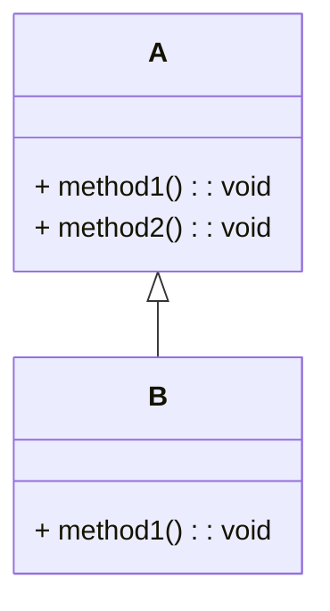
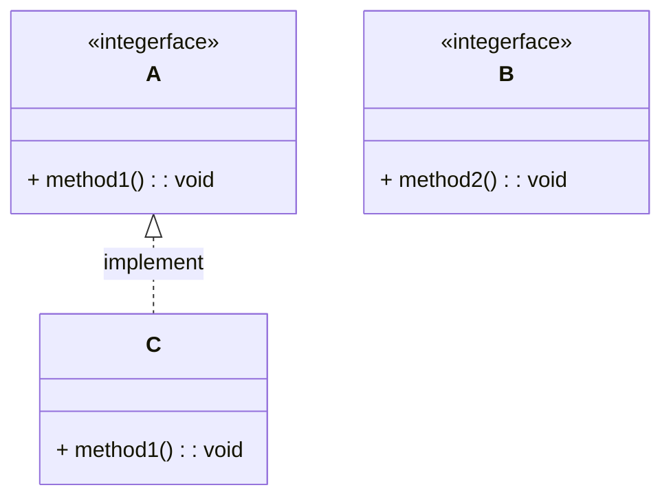
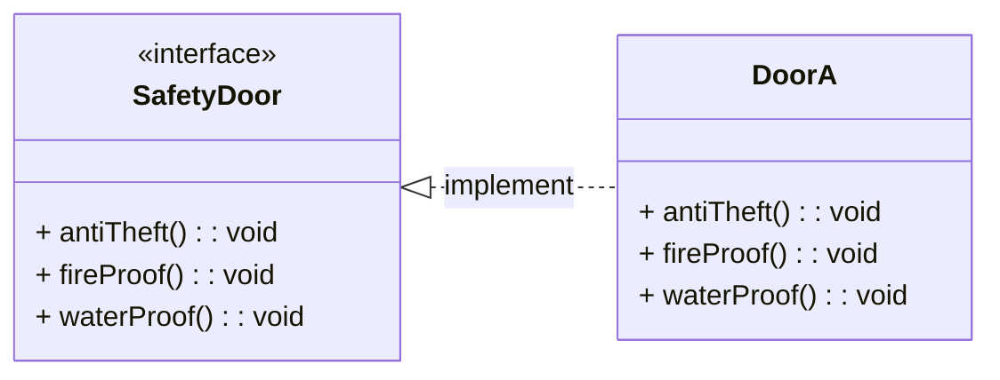
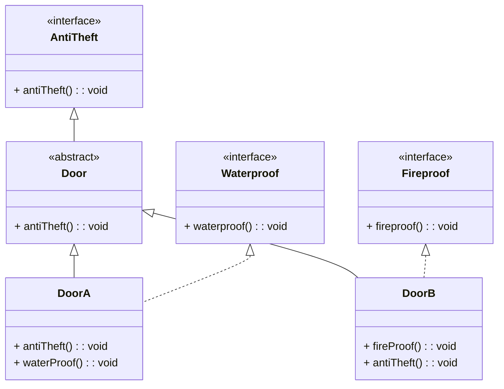
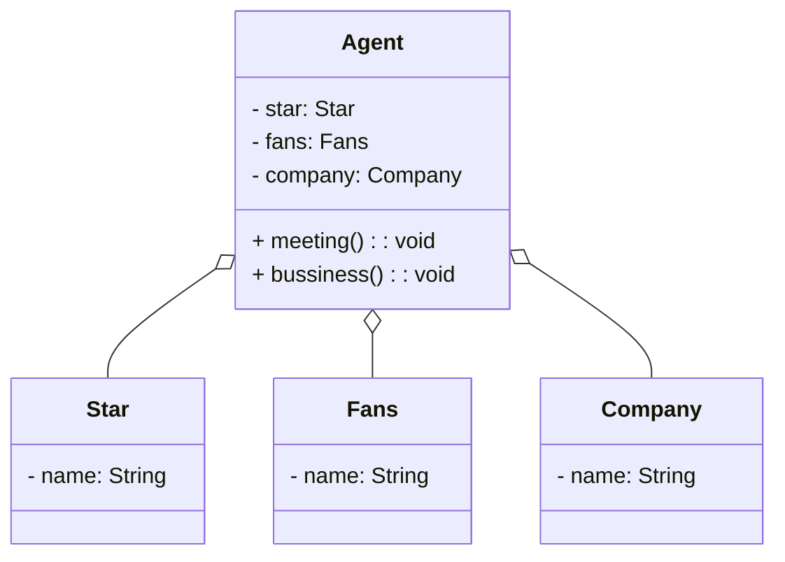
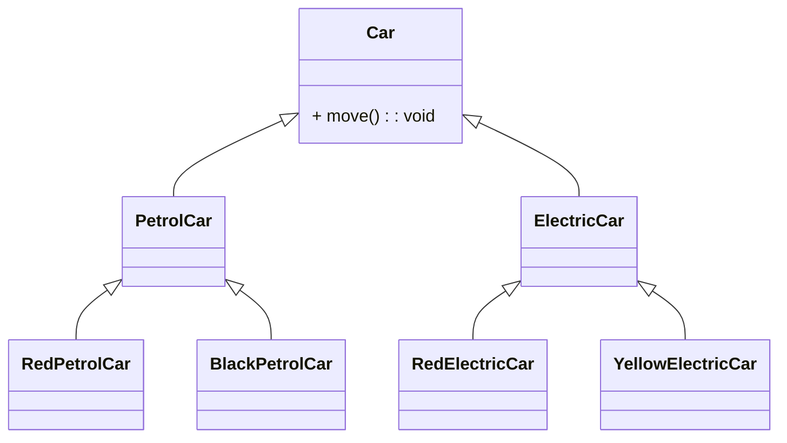
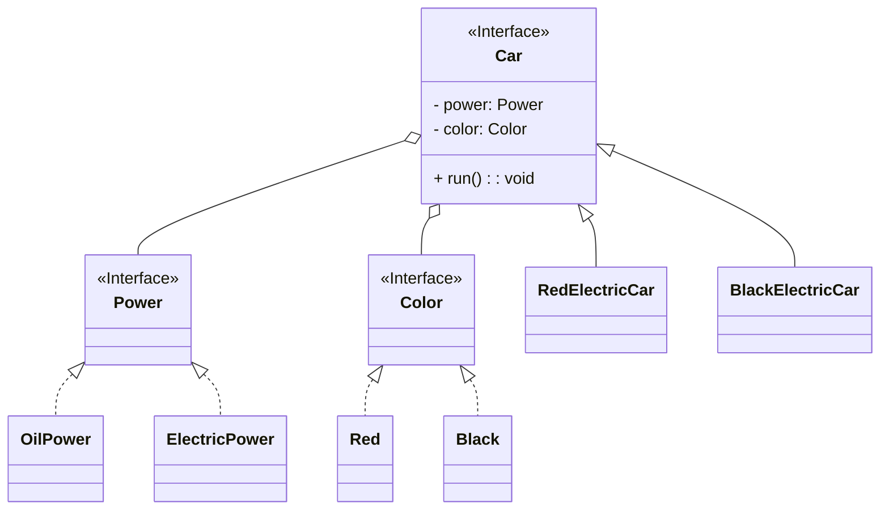

# 软件设计原则

## 1 开闭原则

> 对扩展开放，对修改关闭

要达到这样的效果，需要使用**接口和抽象类**。软件中的易变细节可以通过抽象类派生的实现类进行扩展。

### 案例-搜狗输入法皮肤设计


用户窗体可以根据需要选择或者新增新的皮肤，而不需要修改源代码，满足开闭原则。

## 2 里氏代换原则

> 任何父类可以出现的地方，子类一定可以出现。

子类可以拓展父类的功能，但是不能改变父类原有的功能。

### 案例——正方形不是长方形

**原来的类图**


```java
/**
 * 扩宽方法
 * @param rect
 */
public static void resize(Rectangle rect) {
    // 判断宽比长小，进行扩宽的方法
    while (rect.getLength() >= rect.getWidth()) {
        rect.setWidth(rect.getWidth() + 1.0);
    }
}
```

对正方形进行扩宽操作，会导致程序出现死循环，这是因为正方形中`setLength(double length)`破坏了父类的方法，导致基类能使用的地方，子类反而不能使用了。

**改进类图**


## 3 依赖倒转原则

> 高层模块不应当依赖于低层模块，两者都应该依赖于其抽象。抽象不应当依赖于细节，细节应当依赖于抽象。

### 案例——组装电脑

* **一台整机的架构**


**有什么问题**？

* 整机：只能是固定品牌的组件，奸商坑小白
* 我们想要DIY
* 违反了开闭原则

**我们自己组装电脑的原则**：


想要选择什么配件，我们自己按需要组装。

## 4  接口隔离原则

> 客户端不应当被迫依赖于它不适用的方法；一个类对另一个类的依赖应当建立在最小接口之上。



如上图所示：

* B类继承了A类，就拥有了方法1 的功能
* B类不需要发方法2的功能，被迫依赖于它不使用的方法2

**改进后的结构**



### 案例——安全门

**老安全门结构**



### 新安全门的结构




## 5 迪米特法则

> 最小知识原则：如果两个软件实体无需直接通信，就不应该发生直接的相互调用，可以通过第三方转发该调用。

其目的就是为了降低类之间的耦合度。

### 案例——明星与经纪人




## 6 合并复用原则

> 尽量使用组合或者聚合关系等关联关系来实现，其次才考虑继承关系。

**继承复用的缺点**

* 破坏了类的封装性。父类中的实现细节暴露给子类。
* 子类与父类的耦合度比较高：父类的任何实现的改变都会影响到子类
* 限制了复用的灵活性：父类继承而来的实现是静态的，在编译时期就已经确立

**组合复用的优点**

* 维持了类的封装性
* 对象之间的耦合度比较低
* 复用的灵活性比较高

### 案例——汽车管理系统

汽车按照动力可以分为燃油车、电动车、混动车，根据颜色分类分为白色、黑色、红色……等



继承复用产生了许多子类，如果有新的类型的车子，就会有许多新的类。

**使用组合复用之后**：



